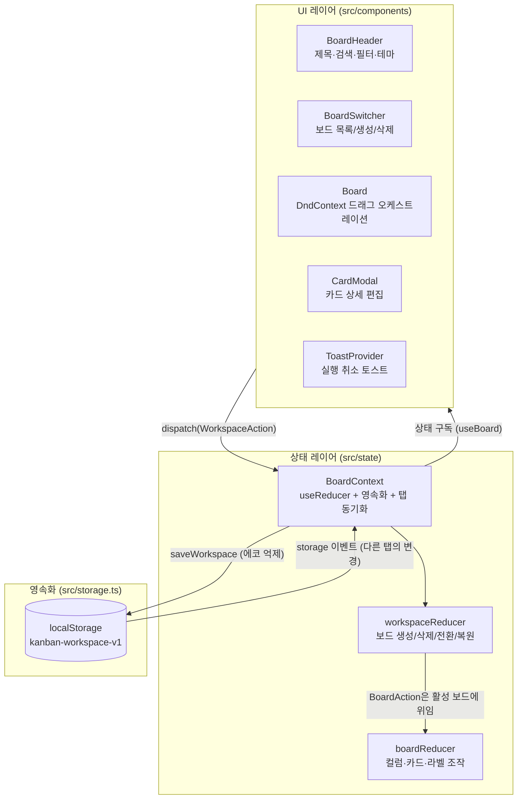
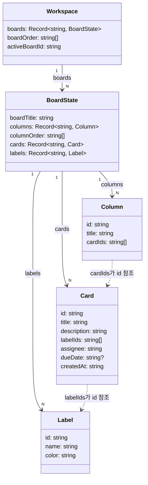
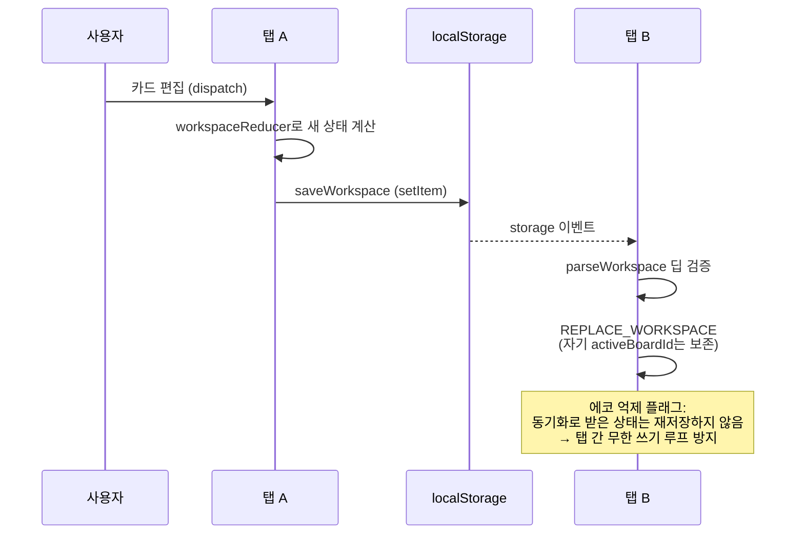
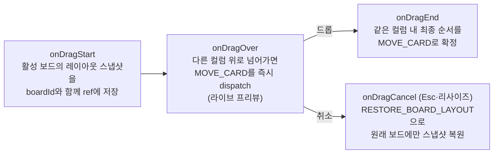
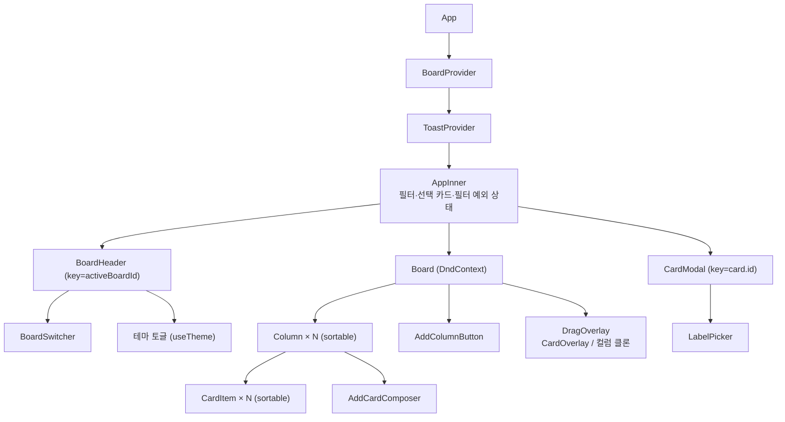

# 아키텍처 구성도

칸반 보드의 아키텍처 문서입니다.

- **스택**: React 19 · TypeScript(strict) · Vite 8 · @dnd-kit(드래그&드롭) · lucide-react(아이콘) / 백엔드: Spring Boot 4(Java 21) · JPA · PostgreSQL
- **형태**: SPA + 선택적 문서형 백엔드 — 백엔드가 있으면 서버가 진실의 원천(브라우저·기기 간 동기화), 없으면 localStorage 단독 모드로 자동 폴백
- **테스트**: vitest 단위 테스트(리듀서·유틸) + Spring Boot API 테스트 + Playwright E2E 스위트

## 1. 레이어 구조

UI 레이어는 `WorkspaceAction`을 dispatch하고 컨텍스트에서 활성 보드 상태를 구독합니다.
상태는 단일 `useReducer`로 관리되고, 변경될 때마다 localStorage에 저장되며
`storage` 이벤트로 다른 탭과 동기화됩니다.



## 2. 데이터 모델

**정규화 상태**: 카드 본문은 `cards` 맵에 한 번만 존재하고, 컬럼은 `cardIds`로
순서만 관리합니다. 드래그 이동은 id 배열 조작일 뿐이라 카드 본문 복사가 없습니다.
라벨·컬럼·카드는 보드별로 스코프가 분리됩니다.



## 3. 리듀서 합성과 액션 카탈로그

`workspaceReducer`는 워크스페이스 자체 액션만 직접 처리하고, 나머지 `BoardAction`은
**활성 보드에 위임**합니다(`boardReducer` 합성). 덕분에 컬럼/카드/모달 등 기존 컴포넌트는
다중 보드 도입 시 수정이 필요 없었습니다. 두 리듀서 모두 순수 함수이며, id 생성 같은
부수효과는 dispatch 시점에 만들어 액션에 담습니다(테스트 결정성).

| 레벨 | 액션 | 설명 |
|---|---|---|
| 워크스페이스 | `CREATE_BOARD` | 보드 추가 후 즉시 활성화 |
| 워크스페이스 | `DELETE_BOARD` | 마지막 1개는 보호. 활성 보드 삭제 시 이전 순서 보드로 이동 |
| 워크스페이스 | `SELECT_BOARD` / `MOVE_BOARD` | 활성 보드 전환 / 보드 순서 변경 |
| 워크스페이스 | `REPLACE_WORKSPACE` | 탭 간 동기화용 전체 교체. 이 탭의 activeBoardId 보존 |
| 워크스페이스 | `RESTORE_BOARD_LAYOUT` | 드래그 취소 롤백 — 스냅샷을 뜬 보드에만 레이아웃 복원. 스냅샷 이후 생긴 컬럼/카드는 병합해 고아를 만들지 않음 |
| 워크스페이스 | `RESTORE_CARD/COLUMN/LABEL/BOARD` | 삭제 실행 취소용 대상 지정 복원 — 삭제된 것만 원위치에 되살리고 그 사이의 다른 변경은 보존. 이미 복원돼 있으면 no-op |
| 보드 (위임) | `SET_BOARD_TITLE` | 활성 보드 이름 변경 |
| 보드 (위임) | `ADD/RENAME/DELETE/MOVE_COLUMN` | 컬럼 CRUD와 순서 변경 |
| 보드 (위임) | `ADD/UPDATE/DELETE/MOVE_CARD` | 카드 CRUD와 이동(remove-then-insert = arrayMove 의미론). ADD_CARD는 `at:'start'`로 맨 위 추가 지원 |
| 보드 (위임) | `ADD/UPDATE/DELETE_LABEL` | 라벨 생성/편집/삭제(삭제 시 모든 카드에서 참조 제거) |

## 4. 영속화와 동기화

세 계층이 있습니다: **서버(PostgreSQL, 진실의 원천)** ← 4초 폴링/디바운스 PUT → **localStorage(미러·오프라인 폴백)** ← storage 이벤트 → **다른 탭**.

**백엔드 API** (`backend/`, 문서형 — 프론트 저장 구조를 그대로 반영):

| 메서드 | 경로 | 역할 |
|---|---|---|
| GET | `/api/workspace` | `{version, workspace}` 또는 404(version 0) |
| GET | `/api/workspace/version` | 폴링·백엔드 감지용 경량 조회 (문서 없으면 0) |
| PUT | `/api/workspace` | 전체 저장. `baseVersion` 선행조건 불일치 시 **409**. 행 잠금(PESSIMISTIC_WRITE)으로 version 증가 직렬화. 기동 시 단일 행(version 0) 시드 |

**프론트 동기화 규칙** (`BoardContext`):
- 백엔드 감지는 `/version`(항상 200 JSON)으로 — 정적 호스팅의 404/SPA 폴백을 '빈 서버'로 오판하지 않음
- 마운트 시: 서버 문서 있으면 적용, 비어 있으면(version 0) 로컬 데이터 마이그레이션, 접속 불가면 localStorage 모드(이후 폴링이 백엔드를 재감지하면 서버 모드로 승격)
- **재조정**: 미러의 기반 버전(`kanban-workspace-base-version`)이 서버 버전과 같은데 내용이 다르면 = 미전송 변경 → 서버로 밀어올림 (탭 강제 종료·keepalive 한도 초과로 유실된 저장의 복구 경로)
- 상태 변경 → localStorage 즉시 미러 + 400ms 디바운스 PUT(`baseVersion` 포함). **실패 시 dirty 복구 + 3초 재시도**, **409 시 서버 상태 pull + 충돌 토스트**(남의 확정 저장을 덮지 않음)
- 4초 폴링으로 version 비교 후 적용(미러도 갱신). dirty 있으면 건너뜀
- 탭 가려짐(visibilitychange)에 선제 플러시, `pagehide`엔 keepalive PUT(본문 64KiB 한도 초과 시 일반 fetch로 최선 노력 — 실패해도 재조정이 복구)

- 저장 키: `kanban-workspace-v1` (레거시 `kanban-board-state-v1` 단일 보드는 첫 로드 때 자동 마이그레이션)
- 로드/수신 시 **딥 검증**(`parseWorkspace`/`isValidWorkspace`): 구조 + 참조 무결성(cardIds→cards, columnOrder→columns,
  activeBoardId 존재)을 검사해 손상 데이터로 인한 렌더 크래시 루프를 차단. 실패 시 시드로 폴백
- **에코 억제**: storage 이벤트·서버 폴링으로 받은 상태는 다시 저장하지 않음 — 두 탭의 activeBoardId가
  다를 때 서로의 저장을 무한히 덮어쓰는 핑퐁 루프 방지 (`BoardContext`의 `skipNextPersist` ref)



**실행 취소(undo)** 는 대상 지정 복원(targeted restore)입니다: 삭제 시점에 "무엇을 어디에
되살릴지"만 캡처해(`RESTORE_CARD/COLUMN/LABEL/BOARD`) 토스트에 붙잡아 두고, '실행 취소' 클릭 시
그것만 원위치에 되살립니다 (`useUndoableDelete`). 전체 스냅샷 교체가 아니므로 토스트가 떠 있는
동안(또는 confirm 대기 중) 수행한 다른 변경을 덮어쓰지 않으며, 캡처는 렌더 클로저가 아닌
최신 상태 ref에서 dispatch 시점에 수행합니다.

## 5. 드래그&드롭 파이프라인

@dnd-kit의 multiple-containers 패턴입니다. 센서는 입력 장치별로 분리되어 있습니다:

- **MouseSensor**: 4px 이동 시 드래그 시작 (클릭과 구분)
- **TouchSensor**: 250ms 길게 누르면 드래그, 짧은 스와이프는 브라우저 스크롤로 통과
  (CSS `touch-action: manipulation`과 세트)
- **KeyboardSensor**: 카드/컬럼 포커스 후 Space로 드래그, 화살표로 이동 (카드의 Enter는 상세 모달 열기)



핵심 설계 포인트:

- **라이브 프리뷰의 대가**: `onDragOver`가 실제 상태를 즉시 바꾸므로 "취소" 개념을 위해
  스냅샷/복원이 필수. 스냅샷은 보드 id에 바인딩되고 레이아웃만 담아, 드래그 중 활성 보드가
  바뀌거나(원격 삭제 등) 다른 탭이 카드 내용을 편집해도 오염·유실이 없다
- **필터 중 드래그**: 화면의 필터된 카드 기준으로 드롭 위치를 잡되, 삽입 인덱스는 전체
  `cardIds`에서 계산해 순서가 깨지지 않음

## 6. 컴포넌트 트리



- `BoardHeader`의 `key=activeBoardId`: 보드 전환 시 리마운트해 제목 편집 draft 등
  이전 보드의 로컬 UI 상태 잔존을 차단
- 필터/선택 카드는 `AppInner` 로컬 상태(영속화 대상 아님). 보드 전환 시
  **렌더 중 리셋 패턴**으로 초기화해 이전 필터가 한 프레임 보이는 깜빡임 방지
- 삭제된 라벨/담당자가 필터에 남는 유령 필터는 `effectiveFilters` 파생값으로 자동 정리

## 7. 횡단 관심사

| 관심사 | 구현 |
|---|---|
| 한글 IME | 모든 Enter/Esc 처리 입력에 `isComposing` 가드 — 조합 중 키가 제출/닫기로 오작동하지 않음 |
| 테마 | `:root` 디자인 토큰을 `:root[data-theme='dark']`에서 오버라이드. `color-scheme`으로 네이티브 위젯 대응. FOUC 방지 인라인 스크립트 |
| Esc 레이어링 | 팝오버 열림 → Esc는 팝오버만, 편집 중 필드 → Esc는 편집 취소만, 그 외 → 모달 닫기 |
| 접근성 | 카드 Enter=상세 열기 / Space=키보드 드래그, 모달 포커스 트랩+복원, 삭제 버튼 `:focus-within` 노출, 토스트 `role="status"` |
| 클릭 아웃사이드 | `useClickOutside` — 캡처 단계 pointerdown이라 드래그 방지용 stopPropagation과 충돌 없음 |

## 8. 디렉토리 구조

```
kanban-board/
├── front/     # React 프론트엔드
├── backend/   # Spring Boot(Java) — src/main/java/com/kanban/{workspace,config}
└── *.md

front/src/
├── types.ts               # 도메인 타입 (Workspace / BoardState / Column / Card / Label)
├── seed.ts                # 시드 보드, 새 보드 템플릿
├── storage.ts             # localStorage 로드/저장, 딥 검증, 레거시 마이그레이션
├── filtering.ts           # 카드 필터 매칭
├── utils.ts               # id 생성, 아바타, 마감일 상태 계산
├── hooks/
│   ├── useClickOutside.ts
│   ├── useTheme.ts        # 다크모드 토글 + 영속화
│   └── useUndoableDelete.ts # 삭제 + 실행 취소 토스트
├── state/
│   ├── boardReducer.ts    # 보드 내부 조작 (순수 함수)
│   ├── workspaceReducer.ts# 보드 관리 + 위임 (순수 함수)
│   └── BoardContext.tsx   # useReducer + 저장 + 탭 동기화
└── components/            # §6 컴포넌트 트리 참조
```
